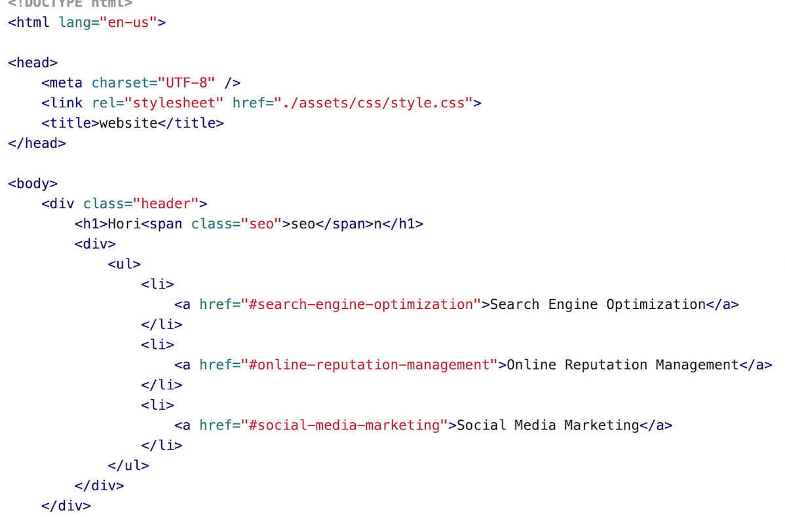
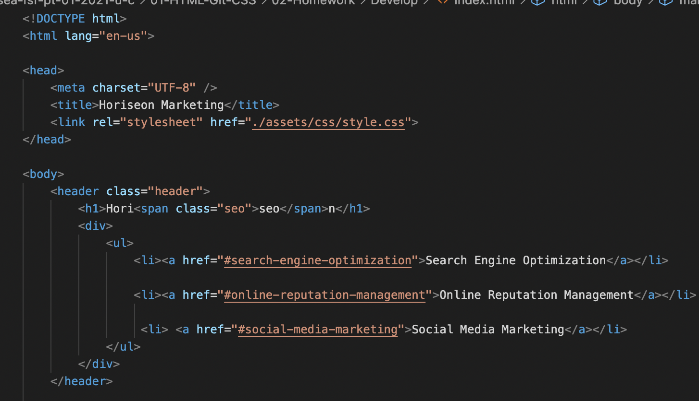
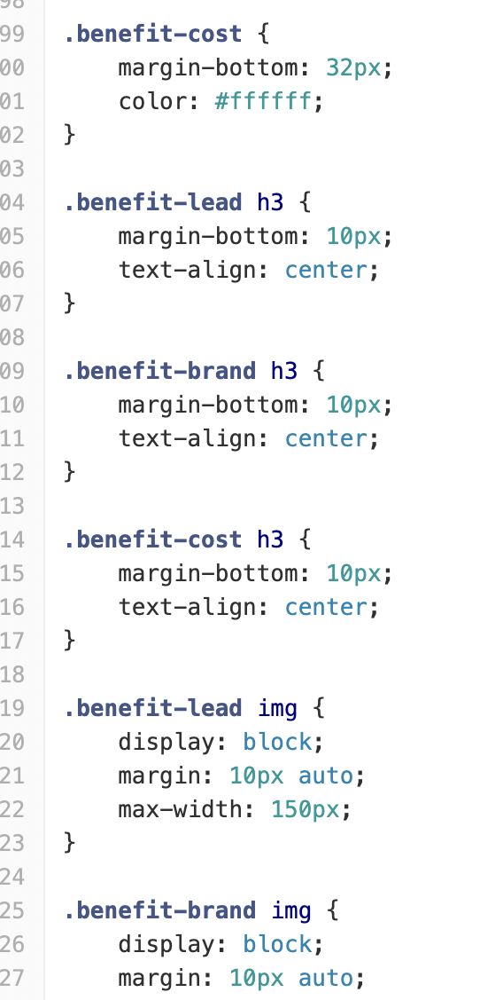
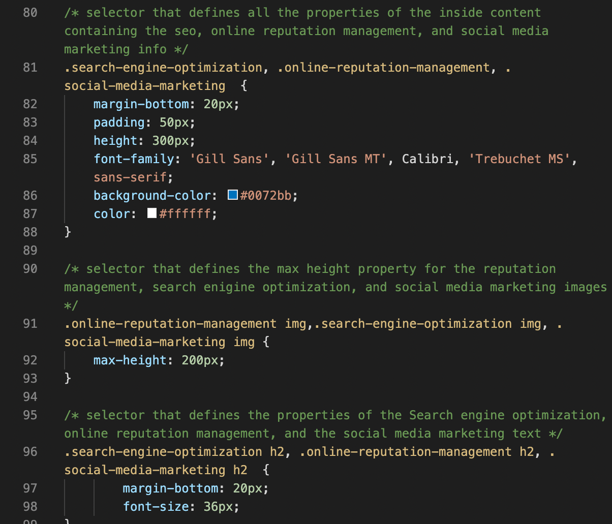

# Week One Homework Assignment- Code Refactor

** Version 1.0 **

 # Description

    This is a sample of the first homework assignment from the instructor that was given to the class. The purpose was to orginaze and consolidate different areas of the HTML and CSS semantic structure in order to improve web accesability within the browser without changing the apperance of the web page. 

# Images

# Coding Languages Used

    * HTML
    * CSS

# Contributors

    Marisa Hanna

# Link To Finished Product

    The link to view this finished project can be found here:
[page link](https://marisahanna.github.io/refactor-wk1/)
